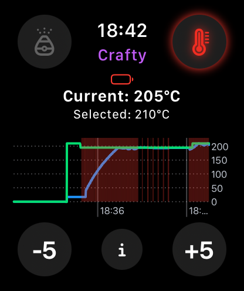

# sbcontrol

This is a remote control app for Storz & Bickel devices using BLE for communication.

This app can be built for:
- macOS
- iOS
- iPadOS
- watchOS

And will allow you to control the features of your Storz & Bickel devices using your Apple devices (currently only Volcano and Crafty).

## State of this repo

You can build the app yourself and create beta builds but Apple will not let you make a release without written approval from Storz & Bickel (after more than half a year they never responded so you'll probably not get it either).

**Warning: While this works on watchOS, it will severely affect the battery life of your Apple Watch! I recommend using an iPhone while on the go!**

**Another warning: The BLE communication with Storz & Bickel devices is not secured at all. The only thing giving security is that you can't connect a second device while one is already connected, that's not a bug/feature of this app, it's how the devices work.**

**Final warning: as it says in the license, this code is provided as-is, without any warranties. Interacting with real-world devices, especially those that get hot on purpose can be dangerous. Don't let your device unattended, especially not in a switched-on state.**

## Logo License

The logo is all rights reserved, I made it myself and would hate for it being used for something else. 
You can use it for this app, especially in case you get a response by S&B and are about to publish it, but don't use it for anything else. Thanks.
